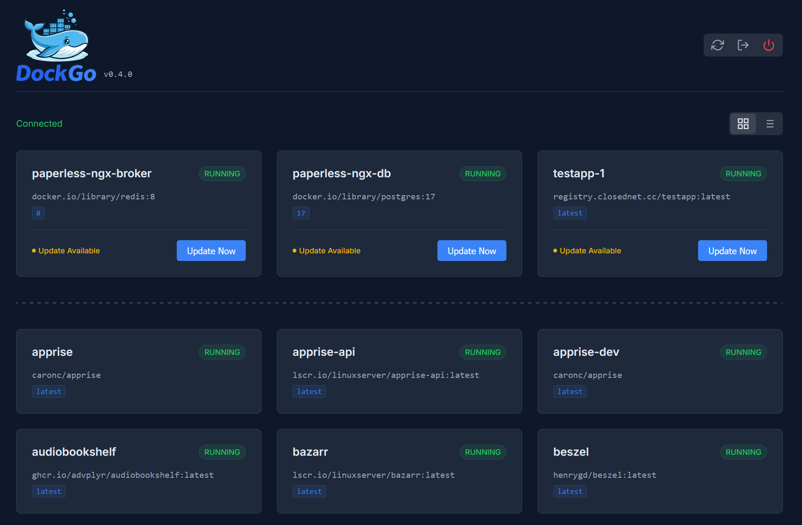

# DockGo 🐳

> **A lightweight, secure Docker update agent — single binary, no fuss.**



## What is DockGo?

DockGo is a simple, single-binary application that monitors your Docker containers for updates. It focuses on visibility and control rather than automatic unattended updates and it provides:
1.  A **Web Dashboard** to see container status and available updates at a glance.
2.  A **CLI** for scripting and manual checks.
3.  **Smart Updates** that handle standard containers, private registries, and Docker Compose services.

## Why DockGo?

Most Docker update tools (like Watchtower or Ouroboros) are great, but can be:
*   **Heavy**: Running complex logical loops or requiring root.
*   **Insecure**: Often demanding full root access to the socket without dropping privileges or providing authentication.
*   **Opaque**: Updating things silently without a clear UI to see *what* is happening.

**DockGo is different:**
*   **Security-focused by default**: Runs as a non-root user (`dockgo`).
*   **Transparent**: You decide when to update (via UI or CLI), or automate it with scripts.
*   **Lightweight**: Written in Go, typically very low memory footprint (~10–30MB).

---

## Quick Start

The fastest way to run DockGo is via Docker:

```bash
docker run -d \
  --name dockgo \
  -p 3131:3131 \
  -v /var/run/docker.sock:/var/run/docker.sock \
  -e LOG_LEVEL=info \
  dockgo/dockgo
```

Visit **http://localhost:3131** to see your dashboard!

---

## Security Model

DockGo takes security seriously.

1.  **Non-Root Execution**: Inside the container, the process runs as the `dockgo` user (UID 1000), not root.
2.  **Socket Permissions**: The entrypoint script creates a `docker` group matching the host's socket GID, allowing the `dockgo` user to talk to the engine without being root.
3.  **Authentication**:
    *   **User Login**: Set `AUTH_USERNAME` and map either `AUTH_PASSWORD_HASH` (recommended) or `AUTH_PASSWORD` (convenience/testing) to enable a secure login flow with HttpOnly cookies.
        *   *Generate hashes using the built-in CLI command, e.g., `dockgo hash-password secret`.*
    *   **Legacy Token**: Set `API_TOKEN` for simple script integrations.
    *   **CORS**: Disabled by default. Only enabled if you specifically set `CORS_ORIGIN`.
4.  **Compose Path Restrictions**: The `ALLOWED_COMPOSE_PATHS` environment variable lets you restrict which Docker Compose working directories can be updated. This is a defense-in-depth measure to prevent accidental or malicious updates outside your intended container environments. **Note:** This restriction only applies to updates, not discovery—DockGo will still discover and monitor all containers on your system, but will only allow updating those whose compose files are within the allowed paths.
5.  **Log Redaction**: Sensitive errors and login failures are redacted in logs.
6.  **Hardened SSE Streams**: All real-time progress events are strictly JSON-marshaled and HTML-escaped to prevent XSS and stream-breaking injections.
7.  **Deep RNG Validation**: Fail-fast architecture that terminates the application immediately if the host operating system's entropy pool (`crypto/rand`) fails to provide secure random bytes.
8.  **Strict Credential Omission**: Sensitive fields (passwords/tokens) are cryptographically tagged to be omitted from all JSON serialization at the compiler level.

> [!CAUTION]
> **CRITICAL SECURITY WARNING: Docker Socket Exposure**
>
> Mounting `/var/run/docker.sock` explicitly grants **full root-level access** to your host machine. This is an unavoidable requirement for any tool that manages Docker containers, but it comes with severe security implications.
>
> **You MUST:**
> 1. **Never expose DockGo publicly to the internet** without robust authentication.
> 2. **Use Network Isolation:** Run DockGo on a trusted, private local network.
> 3. **Implement a Reverse Proxy:** If you must expose it, place it behind a secure reverse proxy (like Nginx, Traefik, or Caddy) equipped with SSL/TLS and preferably external Single Sign-On (SSO) or robust reverse-proxy-level authentication, *in addition* to DockGo's built-in authentication.
>
> Failing to secure this endpoint means giving anyone on the internet immediate root access to your entire server.

---

## Features

*   **Web Dashboard**: Real-time status, "Update" buttons, and progress tracking.
*   **Smart Discovery**:
    *   Checks standard Docker Hub images.
    *   Supports **Private Registries** (using your host's credentials).
    *   Works for most standard **Docker Compose** setups.
*   **Apprise Notifications**: Sends instant automated alerts for newly discovered updates and container upgrade status to over 100+ supported services (Discord, Slack, Telegram, Gotify, etc.).
*   **Autonomous Scheduler**: Periodically checks for container updates in the background without needing the UI open (default: 24h).
*   **Safe Mode**: Use `--safe` (or Safe Mode in UI if implemented) to pull images without restarting running containers.
*   **Network Preservation**: Keeps static IPs and MAC addresses when recreating containers.
*   **Registry Caching**: Caches registry digests for 10 minutes to prevent rate-limiting.
*   **Log Level Control**: adjustable verbosity via `LOG_LEVEL`.

---

## Configuration

Configure DockGo using environment variables:

| Variable | Description | Default |
| :--- | :--- | :--- |
| `PORT` | Web server port | `3131` |
| `LOG_LEVEL` | Log verbosity (`debug`, `info`, `warn`, `error`) | `info` |
| `AUTH_USERNAME` | Username for web login | *(empty)* |
| `AUTH_PASSWORD_HASH`| Pre-hashed bcrypt string (Recommended for production) | *(empty)* |
| `AUTH_PASSWORD` | Plaintext password (Convenience/Testing) | *(empty)* |
| `AUTH_SECRET` | Secret for signing session cookies | *(random)* |
| `AUTH_BCRYPT_COST` | Configurable bcrypt hashing cost (min 4, max 31) | `10` |
| `API_TOKEN` | Legacy token for API updates | *(empty)* |
| `CORS_ORIGIN` | Allowed Origin for CORS (e.g. `https://mydomain.com`) | *(disabled)* |
| `ALLOWED_COMPOSE_PATHS` | Comma-separated list of allowed base paths for Compose working directories (e.g., `/opt/docker,/srv/compose`) | *(empty)* |
| `APPRISE_URL` | Apprise notification endpoint (e.g., `discord://...`) | *(empty)* |
| `APPRISE_QUEUE_SIZE` | Buffer size for outbound notification events | `200` |
| `SCAN_INTERVAL` | Background update polling schedule (`s`, `m`, `h`) | `24h` |

---

## Documentation

For deeper dives into specific integrations and features, check out our [Documentation Folder](./documentation/):
*   [Apprise Integration Guide](./documentation/apprise.md)
*   [API Token Authentication](./documentation/api_token.md)
*   [GitHub Actions Release Flow](./documentation/github_actions.md)

**Example `docker-compose.yml`:**

```yaml
services:
  dockgo:
    image: dockgo/dockgo
    volumes:
      - /var/run/docker.sock:/var/run/docker.sock
    ports:
      - "3131:3131"
    environment:
      - LOG_LEVEL=info
      - AUTH_USERNAME=admin
      # Generate with: dockgo hash-password your_password
      - AUTH_PASSWORD_HASH=$$2a$$10$$YOUR_GENERATED_HASH_HERE
      # Optional: Restrict updates to specific Compose directories
      - ALLOWED_COMPOSE_PATHS=/opt/docker,/srv/compose
```

---

## CLI Usage

You can use the `dockgo` binary directly for scripting or manual checks.

```bash
# Check all containers
dockgo check

# Check with JSON output (great for scripts)
dockgo check -json

# Generate a password hash for the dashboard server configuration
dockgo hash-password supersecretpassword
dockgo check -json

# Update a specific container
dockgo update -y my-container

# Update ALL containers
dockgo update -a

# Safe Mode: Pull only, don't restart running containers
dockgo update -safe -a

# Force Mode: Restart even if running
dockgo update -force -y my-container
```

```bash
# Typical workflow:
dockgo check
dockgo update -a
```

### Flags

*   `-y <name>`: Target specific container.
*   `-a`: Target all containers with updates.
*   `-json`: Output standard JSON.
*   `-stream`: Output SSE-compatible line-delimited JSON.
*   `-preserve-network`: Preserve network settings (IP/MAC) during recreation.

---

### Building from Source

```bash
git clone https://github.com/yourusername/dockgo.git
cd dockgo
go build -o dockgo ./cmd/dockgo
```

### Building for Windows


### Troubleshooting

#### Windows Connection Issues

If you see an error like `failed to connect to Docker`, ensure Docker Desktop is running. You may need to set the `DOCKER_HOST` environment variable if the default connection fails:

```powershell
$env:DOCKER_HOST = "npipe:////./pipe/docker_engine"
```

#### Docker Container "no such file or directory"

If the container crashes with `exec ./entrypoint.sh: no such file or directory`, it likely has Windows line endings (CRLF). Ensure `entrypoint.sh` uses Unix line endings (LF). The build process should handle this, but if you are mounting the file locally, you may need to convert it.

