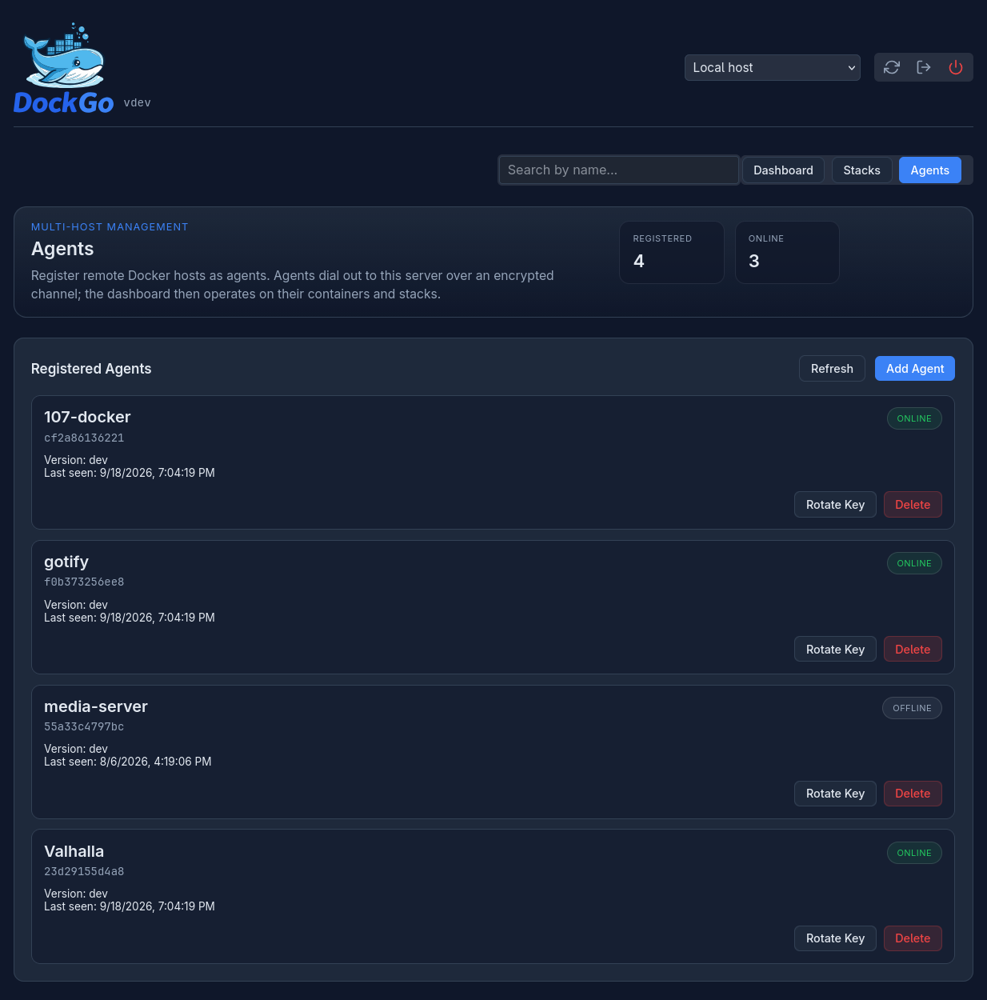

# Multi-Host Management with DockGo Agents



DockGo can manage Docker containers and Compose stacks on **multiple remote
hosts from a single dashboard**. A lightweight **agent** runs on each managed
host (where the Docker socket lives) and establishes an outbound encrypted
channel to the DockGo server. The server then relays the existing dashboard
operations (containers, scans, updates, logs, stats, stacks) to the agent.

```
+-----------------------------------------------------------+
| DockGo Server                                              |
|  - existing REST/SSE UI endpoints                          |
|  - /api/agents/* management + /api/ws/agent                |
|  - agentmanager: channel registry, JWT, op relay           |
+-----------------------------------------------------------+
                       ^  wss:// (outbound)
                       |
+-----------------------------------------------------------+
| DockGo Agent (per managed host)                            |
|  - dials server /api/ws/agent with AGENT_KEY               |
|  - owns the Docker client + registry cache + compose CLI   |
|  - handles request_id-tagged ops, streams events           |
|  - reconnect with backoff, heartbeat                       |
+-----------------------------------------------------------+
```

## How it works

- **Topology**: agents dial **out** to the server. No inbound ports are needed
  on the agent host, so agents work behind NAT and firewalls.
- **Transport**: one persistent WebSocket (`wss://`) per agent using JSON
  messages. Multiple operations are multiplexed over the channel using
  `request_id` tags; progress and log events are streamed as separate messages
  and relayed to the correct web client SSE stream.
- **Auth**:
  1. The operator creates an agent on the server **Agents** page. The server
     generates a key (`dg_<base64url>`) shown **exactly once**.
  2. The key is set as `AGENT_KEY` on the agent host.
  3. On connection, the agent presents the key. The server hashes keys with
     bcrypt at rest and issues a short-lived JWT for the channel (default 1h).
     On reconnects the agent authenticates with the previously issued JWT;
     the key is only required on the first registration or if the JWT is
     rejected.
- **Stacks**: stacks remain centrally stored on the server. Each stack can be
  assigned to an agent host (`agent_id`); compose paths then resolve on the
  **agent host's** filesystem. Git-kind stacks are **not** supported on remote
  agents (server-local only).

## Security model

- The registration endpoint rate limits **failed** handshakes per IP
  (5 failures/min). Successful reconnects are never throttled.
- Each agent is capped at `AGENT_MAX_CONCURRENT` (default 8) simultaneous
  operations.
- Agent keys are stored only as bcrypt hashes.
- `AGENT_JWT_SECRET` signs agent JWTs and defaults to `AUTH_SECRET` when unset;
  you can set it separately to isolate agent trust.
- **The agent mounts the Docker socket. Socket access is equivalent to root on
  the host.** Run agents only on hosts you trust with the same privileges the
  DockGo server itself requires.

## Setup

### 1. Server side

1. Open the DockGo dashboard and go to the **Agents** view.
2. Click **Add Agent**, enter a name (e.g. `media-server`), and click
   **Create Agent**.
3. Copy the generated key (**shown only once**). If you lose it, use
   **Rotate Key**.

Environment variables on the server:

| Variable | Default | Description |
| --- | --- | --- |
| `AGENT_STORE_PATH` | `/app/data/agents.json` | JSON file that persists agent records |
| `AGENT_MAX_CONCURRENT` | `8` | Per-agent concurrent op cap |
| `AGENT_JWT_TTL` | `1h` | Lifetime of the channel JWT |
| `AGENT_JWT_SECRET` | `AUTH_SECRET` | JWT signing secret for agent channels |

### 2. Agent side

Run the agent as a container on the managed host. Copy the template
[`docker-compose.agent.yml.example`](../docker-compose.agent.yml.example) to
`docker-compose.agent.yml` on each managed host, fill in
`DOCKGO_SERVER_URL` and `AGENT_KEY`, and start it:

```bash
docker compose -f docker-compose.agent.yml up -d
```

```yaml
services:
  dockgo-agent:
    image: ghcr.io/<org>/dockgo:agent-latest
    restart: unless-stopped
    environment:
      - DOCKGO_SERVER_URL=wss://dockgo.example.com/api/ws/agent
      - AGENT_KEY=dg_<generated key>
      - AGENT_NAME=media-server
    volumes:
      - /var/run/docker.sock:/var/run/docker.sock
      # Mount compose directories this agent should manage:
      - /home/user/docker:/compose
```

Agent environment variables:

| Variable | Default | Description |
| --- | --- | --- |
| `DOCKGO_SERVER_URL` | *(required)* | `ws://`/`wss://` server endpoint incl. `/api/ws/agent` |
| `AGENT_KEY` | *(required)* | Registration key from the server Agents page |
| `AGENT_NAME` | hostname | Display name in the dashboard |
| `AGENT_RECONNECT_MIN` | `5s` | Backoff floor |
| `AGENT_RECONNECT_MAX` | `60s` | Backoff ceiling |
| `AGENT_RECONNECT_MULT` | `2.0` | Backoff multiplier |
| `AGENT_HEARTBEAT_INTERVAL` | `30s` | Keepalive ping interval |
| `STACK_STORE_PATH` | `/app/data/agent_stacks.json` | Agent-local compose store (mostly internal) |

The agent needs the Docker CLI and Compose plugin for stack orchestration. The
provided `Dockerfile.agent` includes them.

### 3. Using the dashboard

- Use the **host selector** in the top-right of the dashboard to switch between
  the local host and each registered agent.
- Containers, stats, scans, updates, logs, and stacks all operate on the
  selected host.
- The **Stacks** view for an agent host shows only that agent's stacks. Creating
  a stack while an agent is selected targets that agent (git-kind disabled).
- Agents go **offline** in the selector when disconnected; the dashboard shows
  the host as unavailable for operations until the agent reconnects.

## Key rotation

1. On the **Agents** page, click **Rotate Key** next to the agent.
2. Copy the new key.
3. Update `AGENT_KEY` on the agent host and restart the agent.

Rotating a key immediately invalidates the old one; a running channel is
unaffected until the next reconnect. On reconnect the agent first tries its
channel JWT (which still works); the server then requires the new key, and the
agent falls back to it automatically, so rotation takes effect on the next
reconnect without any outage.

## Disabling / removing an agent

- **Delete** removes the agent record and disconnects its channel. Re-adding it
  requires a new key.
- Channel JWTs expire after `AGENT_JWT_TTL`; a disabled record rejects both JWT
  and key validation on reconnect.

## Troubleshooting

- **Agent shows offline**: verify the agent can reach `DOCKGO_SERVER_URL`
  (the endpoint must be reachable from the agent host, not the server host).
  Check agent logs for `registration rejected`.
- **Registration rejected**: the key is wrong/rotated, the agent name changed,
  or the agent was deleted.
- **Compose stack fails to validate**: paths are resolved on the **agent host**.
  Register stacks whose `working_dir`/compose files exist on that host.
- **Git-kind stack rejected**: remote agents only support compose-file stacks.
