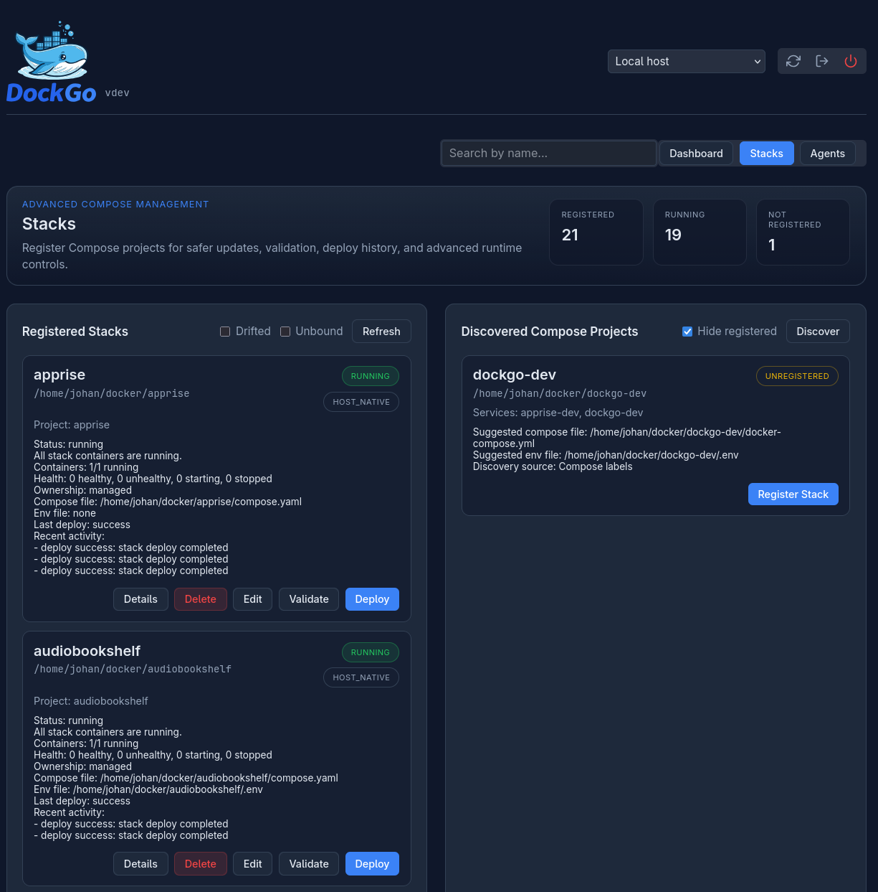

# Stacks

In DockGo, a stack is a registered Docker Compose project.

If you run Compose apps regularly, stacks should be part of your normal workflow.

## Why Register Stacks

Registered stacks give DockGo:

- an explicit compose file
- a known working directory
- validation rules
- deploy history
- ownership of the runtime containers

This is safer than trying to operate only from runtime Docker labels.

## Typical Stack Workflow

1. Discover a Compose project in the `Stacks` view
2. Register it
3. Validate it
4. Deploy it when needed
5. Use the main dashboard for one-click updates afterward

Once a Compose app is stack-managed, dashboard updates use the registered stack behind the scenes.

## Linux: Host Native

Use `Host Native` (`"host_native"`) when DockGo sees the Compose project at the same absolute path as the host.

Example:

- host path: `/home/johan/docker/audiobookshelf`
- DockGo path: `/home/johan/docker/audiobookshelf`

Recommended on Linux.

## Windows: Mapped

Use `Mapped` (`"mapped"`) when DockGo sees the Compose project at a different internal path.

Example:

- host path: `D:\Docker\audiobookshelf`
- DockGo path: `/compose/audiobookshelf`

Typical on Windows with a Linux DockGo container.

## Important Stack States

DockGo tracks two aspects of a stack: its **ownership mode** and its **operational state**.

**Ownership mode** (`ownership_mode`):
- `unbound` — the stack definition exists, but DockGo does not yet own any container IDs for it
- `managed` — the stack owns runtime container IDs

**Operational state** (`state`):

### Unbound

Meaning:

- the stack definition exists
- but DockGo does not yet own any container IDs for it

Common fix:

- `Reconcile` if the containers are already running and correct
- `Deploy` if you want DockGo to recreate and own them

### Running

All stack containers are running (and healthy, if healthchecks exist).

### Starting

Containers are starting or waiting for healthchecks to pass.

### Degraded

Some stack containers are stopped or unhealthy, but at least one is still running.

### Down

All stack containers are stopped.

### Drifted

Meaning:

- DockGo owns container IDs for the stack
- but the currently running containers do not match that ownership anymore

This usually means containers were recreated or changed outside the last known DockGo ownership state.

Common fix:

- `Reconcile` if the currently running containers are the correct ones
- `Deploy` if you want DockGo to reassert the stack definition

## Reconcile

`Reconcile` tells DockGo to adopt the currently running containers for that stack.

Use it when:

- you imported or restored DockGo state
- you registered stacks after a clean install
- containers were recreated outside DockGo and you want DockGo to adopt them

Do not use it blindly if the runtime state is wrong. In that case, fix the stack and deploy instead.

## Validation

Validation checks:

- working directory
- compose file
- env file
- path resolution
- runtime drift warnings

Use `Validate` after editing stack paths or changing mount strategy.

## Editing Compose And Env Files

DockGo can edit the compose and env files of a registered stack directly, from
the dashboard or through the API.

### From the dashboard

Open the editor from a stack's **⋮** menu → **Edit Files**, or from a stack's
Details view → **Edit Files**. The selector at the top lists the stack's compose
files first, then its env files.

The draft is validated as you type, and **Save** stays disabled while it is known
to be invalid. Validating never touches the file — nothing is written until you
save. A save runs the same two checks the API does, and a save that fails either
one is rejected with the previous content restored, so a stack cannot be left
holding a compose file Docker refuses to read. If restoring the previous content
itself fails, the editor says so explicitly: that is the only case in which a
rejected draft may still be on disk, and it is reported rather than hidden.
Closing the editor, or switching files, with unsaved changes asks for
confirmation first.

A `git_repo` stack shows a warning that saving edits the checked-out working copy
and that a later `git pull` may overwrite it. Agent-hosted stacks are edited the
same way from the dashboard; the server proxies each operation to the agent.

### Behaviour and limits

- Content is checked for syntax first (YAML for compose files, `KEY=VALUE` for
  env files) and rejected if it does not parse.
- Saves are then validated with `docker compose config`. A save that fails
  triggers a rollback to the previous content, so a broken stack cannot be
  saved; if the rollback write itself fails, the save returns an error.
- Only files already registered to the stack can be edited, and only within
  `ALLOWED_COMPOSE_PATHS` when that is configured. The server and an agent each
  apply their own value, so the two can differ, and an empty value means no
  restriction on that host — [Agents](./agents.md) documents the agent's.
- Allow-list entries are translated through `COMPOSE_PATH_MAPPING` before they
  are compared, and an entry that cannot be resolved is skipped rather than
  kept. Skipping is per entry, so the check stays active: an allow-list made
  entirely of host-style paths whose mapping is missing blocks every save while
  still looking configured. If every save is rejected as outside the
  allow-list, check the mapping before concluding the allow-list is empty.
- For `git_repo` stacks, saving edits the checked-out working copy; a later
  pull may overwrite those edits.
- Files are addressed with `kind` (`compose` or `env`) and a 0-based `index`
  within that kind; compose files come first, then env files.
- Both `validate` and `PUT` take a JSON body of `{"content": "<draft text>"}`.
- Agent-hosted stacks are editable through these same endpoints. Add the
  `agent` query parameter — exactly as the other agent stack routes take it —
  and the server proxies the operation to the agent, which lists, reads,
  validates, and writes its own copy of the files.
- A file request for an agent-hosted stack that **omits** the `agent` parameter
  is refused with `501 Not Implemented`. That refusal is deliberate and narrow:
  without the parameter the server would resolve the agent's stored paths
  against its own filesystem, so it fails closed instead of guessing.

### Status codes

| Status | Meaning |
| --- | --- |
| `400` | Unknown `kind`, out-of-range `index`, or a malformed request body |
| `403` | The file is outside `ALLOWED_COMPOSE_PATHS`, or is not a regular file |
| `404` | The file does not exist |
| `413` | The file, or the request body, exceeds the 1 MiB cap |
| `422` | The draft failed validation; the body carries the reason |
| `501` | A file request for an agent-hosted stack that omits the `agent` parameter |

## Deploy

`Deploy` runs the registered Compose stack definition and then binds runtime ownership.

If deploy succeeds but ownership cannot be bound, DockGo now treats that as an error instead of silently leaving the stack in a misleading success state.

## API Reference

| Method | Endpoint | Description |
| --- | --- | --- |
| `GET` | `/api/stacks` | List all registered stacks |
| `POST` | `/api/stacks` | Register a new stack |
| `GET` | `/api/stacks/:id` | Get stack details, validation, status, and history |
| `PUT` | `/api/stacks/:id` | Update a stack definition |
| `DELETE` | `/api/stacks/:id` | Unregister a stack |
| `POST` | `/api/stacks/:id/validate` | Validate stack files and paths |
| `POST` | `/api/stacks/:id/deploy` | Deploy the stack (SSE stream) |
| `POST` | `/api/stacks/:id/pull` | Pull stack images (SSE stream) |
| `POST` | `/api/stacks/:id/restart` | Restart stack services (SSE stream) |
| `POST` | `/api/stacks/:id/stop` | Stop stack services, leaving containers in place (SSE stream) |
| `POST` | `/api/stacks/:id/start` | Start previously stopped stack services (SSE stream) |
| `POST` | `/api/stacks/:id/down` | Stop and remove stack services (SSE stream) |
| `GET` | `/api/stacks/:id/files` | List a stack's editable compose and env files |
| `GET` | `/api/stacks/:id/file?kind=&index=` | Read one compose or env file |
| `POST` | `/api/stacks/:id/file/validate?kind=&index=` | Validate draft content without saving |
| `PUT` | `/api/stacks/:id/file?kind=&index=` | Save a file (validated, rolled back on failure) |
| `POST` | `/api/stacks/:id/reconcile` | Adopt currently running containers |
| `GET` | `/api/stacks/:id/history` | Get stack action history (supports `?limit=`, `?action=`, `?status=`, `?source=` filters) |
| `GET` | `/api/stacks/discover` | Discover unregistered Compose projects |

## Troubleshooting Stack Problems

Read [Troubleshooting](./troubleshooting.md) if you see:

- `Unbound`
- `Drifted`
- validation failures
- path mapping issues
- deploy failures
